# PayrollPro System - Comprehensive Analysis Report

> **Academic Project**: Software Platform for Managing Employee Payment Transactions  
> **Analysis Date**: December 24, 2025  
> **Project Type**: Full-Stack MERN Application

---

## Executive Summary

PayrollPro is a comprehensive payroll management system built using the MERN stack (MongoDB, Express.js, React, Node.js). The system implements a dual-portal architecture serving both administrators and employees with distinct functionalities. The application addresses critical organizational needs including automated salary calculation, leave management, employee data management, and real-time notifications.

### Key Metrics
- **Backend Files**: 38 files across 8 directories
- **Frontend Files**: 73 files across 12 directories
- **Database Models**: 5 comprehensive schemas
- **API Endpoints**: 7 route modules with 40+ endpoints
- **UI Pages**: 14 pages (9 admin + 5 employee)
- **Architecture**: Dual-portal (Admin + Employee)

---

## Table of Contents

1. [Project Structure](#1-project-structure)
2. [Backend Architecture](#2-backend-architecture)
3. [Database Schema](#3-database-schema)
4. [Frontend Architecture](#4-frontend-architecture)
5. [Implemented Features](#5-implemented-features)
6. [System Workflows](#6-system-workflows)
7. [Technology Stack](#7-technology-stack)
8. [Security Implementation](#8-security-implementation)

---

## 1. Project Structure

```
payroll/
├── backend/                    # Node.js/Express Server
│   ├── src/
│   │   ├── config/            # Database & Socket.io setup (3 files)
│   │   ├── controllers/       # Business logic (7 controllers)
│   │   ├── middlewares/       # Auth & validation (4 middlewares)
│   │   ├── models/            # MongoDB schemas (5 models)
│   │   ├── routes/            # API endpoints (7 route files)
│   │   ├── scripts/           # Utility scripts (1 file)
│   │   ├── utils/             # Helper functions (6 utilities)
│   │   └── index.js           # Server entry point
│   └── package.json           # Backend dependencies
│
└── frontend/                  # React Application
    ├── src/
    │   ├── api/               # API integration (7 API modules)
    │   ├── components/        # UI components (18 components)
    │   │   ├── common/        # Shared components (4 files)
    │   │   ├── domain/        # Business components (6 files)
    │   │   ├── layout/        # Layout components (6 files)
    │   │   └── ui/            # UI primitives (2 files)
    │   ├── contexts/          # State management (2 contexts)
    │   ├── hooks/             # Custom hooks (8 hooks)
    │   ├── pages/             # Route pages (17 pages)
    │   │   ├── admin/         # Admin portal (9 pages)
    │   │   └── employee/      # Employee portal (5 pages)
    │   ├── routes/            # Routing config (2 files)
    │   ├── utils/             # Utility functions (3 files)
    │   ├── App.jsx            # App entry
    │   ├── main.jsx           # React entry
    │   └── index.css          # Global styles
    └── package.json           # Frontend dependencies
```

---

## 2. Backend Architecture

### 2.1 Server Configuration

**Entry Point**: [index.js](file:///c:/Projects/payroll/backend/src/index.js)

The backend server is built on Express.js with the following architecture:

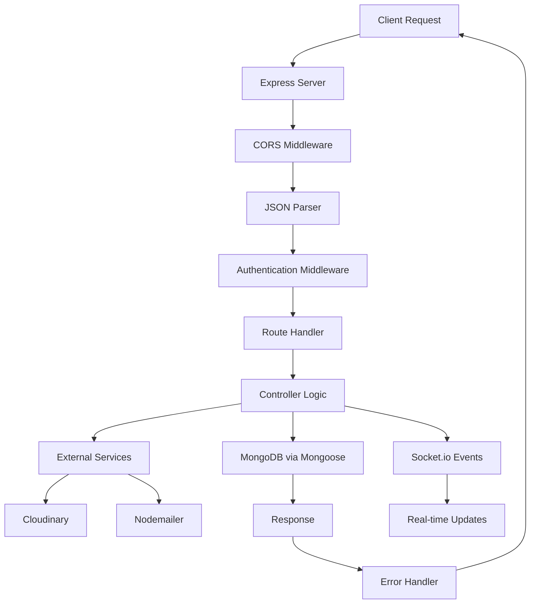

**Server Features**:
- HTTP server with Socket.io integration
- CORS enabled for cross-origin requests
- JSON/URL-encoded body parsing
- Development logging middleware
- Centralized error handling
- Unhandled promise rejection handling

### 2.2 API Routes Structure

| Route Module | Endpoints | Purpose |
|-------------|-----------|---------|
| **authRoutes** | `/api/auth/*` | Login, logout, password management |
| **employeeRoutes** | `/api/employees/*` | Employee CRUD operations |
| **payrollRoutes** | `/api/payroll/*` | Payroll processing & management |
| **payslipRoutes** | `/api/payslips/*` | Payslip generation & retrieval |
| **leaveRoutes** | `/api/leaves/*` | Leave application & approval |
| **notificationRoutes** | `/api/notifications/*` | Notification management |
| **bulkRoutes** | `/api/bulk/*` | Bulk import/export operations |

### 2.3 Controllers

**7 Controllers Implemented**:

#### [authController.js](file:///c:/Projects/payroll/backend/src/controllers/authController.js) (235 lines)
- `login()` - JWT-based authentication with role detection
- `logout()` - Session termination
- `getMe()` - Current user profile
- `changePassword()` - Password update for authenticated users
- `updateProfile()` - Profile information updates
- `forgotPassword()` - Password reset link generation
- `resetPassword()` - Token-based password reset

#### [employeeController.js](file:///c:/Projects/payroll/backend/src/controllers/employeeController.js) (307 lines)
- `createEmployee()` - Employee creation with auto-generated ID
- `getAllEmployees()` - Paginated employee listing with filters
- `getEmployeeById()` - Single employee retrieval
- `updateEmployee()` - Employee data updates
- `deactivateEmployee()` - Soft delete implementation
- `getEmployeeStats()` - Dashboard statistics
- `getEmployeeDashboard()` - Employee portal dashboard data

#### [payrollController.js](file:///c:/Projects/payroll/backend/src/controllers/payrollController.js) (565 lines)
- `processMonthlyPayroll()` - Batch payroll processing
- `getPayrollRecords()` - Filtered payroll retrieval
- `getPayrollById()` - Single payroll details
- `addAdjustment()` - Bonus/penalty adjustments
- `approvePayroll()` - Payroll approval workflow
- `processPayment()` - Payment simulation
- `generatePayslips()` - PDF generation & cloud upload
- `getPayrollSummary()` - Monthly summaries

#### [leaveController.js](file:///c:/Projects/payroll/backend/src/controllers/leaveController.js) (341 lines)
- `applyLeave()` - Leave application submission
- `getAllLeaves()` - Admin leave listing
- `getMyLeaves()` - Employee's own leaves
- `getLeaveBalance()` - Leave quota tracking
- `approveLeave()` - Admin approval with notifications
- `rejectLeave()` - Admin rejection with reason
- `deleteLeave()` - Pending leave cancellation
- `getLeaveStats()` - Leave analytics

#### [payslipController.js](file:///c:/Projects/payroll/backend/src/controllers/payslipController.js) (4893 bytes)
- `getEmployeePayslips()` - Employee payslip history
- `downloadPayslip()` - PDF download functionality
- Email integration for payslip delivery

#### [notificationController.js](file:///c:/Projects/payroll/backend/src/controllers/notificationController.js) (2093 bytes)
- `getNotifications()` - User notification retrieval
- `markAsRead()` - Notification read status
- `markAllAsRead()` - Bulk read operations

#### [bulkController.js](file:///c:/Projects/payroll/backend/src/controllers/bulkController.js) (11930 bytes)
- `bulkImportEmployees()` - CSV employee import
- `exportEmployeesToExcel()` - Excel export functionality
- `exportPayrollToExcel()` - Payroll data export

### 2.4 Middlewares

#### [auth.js](file:///c:/Projects/payroll/backend/src/middlewares/auth.js)
- `protect()` - JWT token verification
- `restrictTo()` - Role-based access control

#### [errorHandler.js](file:///c:/Projects/payroll/backend/src/middlewares/errorHandler.js)
- `AppError` class - Custom error handling
- `asyncHandler()` - Async error wrapper
- `errorHandler()` - Global error middleware
- `notFoundHandler()` - 404 handler

#### [validator.js](file:///c:/Projects/payroll/backend/src/middlewares/validator.js)
- Input validation using express-validator

#### [upload.js](file:///c:/Projects/payroll/backend/src/middlewares/upload.js)
- Multer configuration for file uploads

### 2.5 Utility Services

| Service | Purpose | Key Functions |
|---------|---------|---------------|
| **salaryCalculator.js** | Salary computations | LOP deductions, gross/net calculations |
| **pdfGenerator.js** | Payslip PDFs | PDFKit-based generation, Cloudinary upload |
| **emailService.js** | Email notifications | Welcome emails, password resets, payslips |
| **notificationService.js** | In-app notifications | Leave alerts, payroll notifications |
| **notificationHelper.js** | Admin notifications | System-wide event broadcasting |
| **auditLogger.js** | Audit trail | Employee/payroll action logging |

### 2.6 Real-time Communication

**Socket.io Implementation**: [socket.js](file:///c:/Projects/payroll/backend/src/config/socket.js)

**Events Emitted**:
- `leave:created` - New leave application
- `leave:newApplication` - Admin notification
- `leave:approved` - Leave approval notification
- `leave:rejected` - Leave rejection notification
- `payslip:generated` - Payslip ready notification
- `notification:new` - General notifications

**Features**:
- User-specific event targeting
- Admin broadcast functionality
- Automatic reconnection handling

---

## 3. Database Schema

PayrollPro uses MongoDB with Mongoose ODM for data modeling. The system implements **5 comprehensive models** with extensive validation, virtuals, and business logic.

### 3.1 Employee Model

**File**: [Employee.js](file:///c:/Projects/payroll/backend/src/models/Employee.js) (297 lines, 8006 bytes)

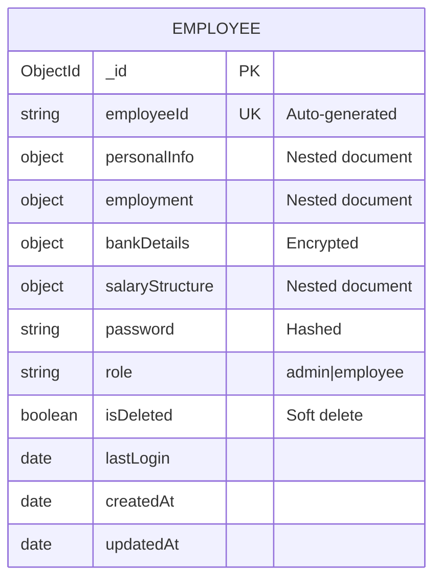

**Key Features**:
- **Auto-generated Employee ID**: Pattern `{DEPT}-{YEAR}-{SEQUENCE}` (e.g., `ENG-2024-1001`)
- **Password Hashing**: Bcrypt with salt rounds of 10
- **Data Masking**: Bank account numbers masked to `****XXXX`
- **Validation**: Email format, phone (10-digit Indian), age (18-65), IFSC code
- **Virtual Fields**: `fullName`, `age`, `maskedAccountNumber`
- **Static Methods**: `findActive()`, `findByDepartment()`
- **Instance Methods**: `comparePassword()`, `getPublicProfile()`

**Schema Structure**:
- **personalInfo**: firstName, lastName, email, phone, dateOfBirth, address
- **employment**: department (6 enum values), designation, dateOfJoining, status
- **bankDetails**: accountNumber, accountHolderName, ifscCode, bankName, branch
- **salaryStructure**: basicSalary, hra, da, specialAllowance, otherAllowances, pfPercentage, professionalTax, esiPercentage

**Departments Supported**: Engineering, Sales, Marketing, HR, Finance, Operations

### 3.2 Payroll Model

**File**: [Payroll.js](file:///c:/Projects/payroll/backend/src/models/Payroll.js) (312 lines, 7978 bytes)

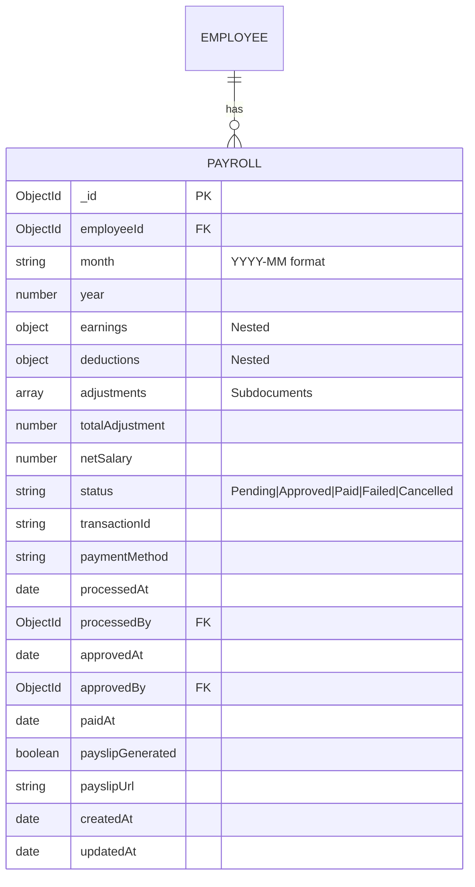

**Key Features**:
- **Unique Constraint**: One payroll per employee per month
- **Adjustment Types**: Bonus, Penalty, Allowance, Deduction, Reimbursement, Recovery
- **Workflow States**: Pending → Approved → Paid
- **Automatic Calculations**: Total adjustments and net salary
- **Index Optimization**: Compound indexes on employee, month, year, and status

**Instance Methods**:
- `addAdjustment()` - Add bonus/penalty with recalculation
- `approve()` - Approve payroll (admin only)
- `markAsPaid()` - Mark as paid with transaction ID
- `markAsFailed()` - Mark failed with reason
- `getSummary()` - Get payroll summary

**Static Methods**:
- `findByMonth()` - Get all payrolls for a specific month
- `findPending()` - Get all pending payrolls
- `getMonthlySummary()` - Aggregate monthly statistics

### 3.3 Leave Model

**File**: [Leave.js](file:///c:/Projects/payroll/backend/src/models/Leave.js) (175 lines, 5084 bytes)

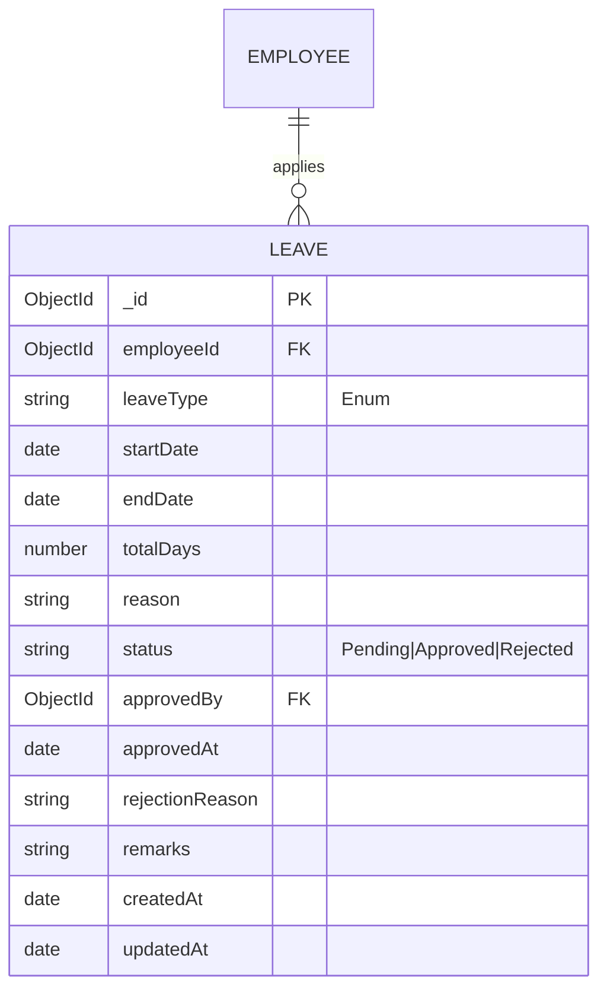

**Leave Types**:
- **Casual**: 12 days allocated
- **Sick**: 12 days allocated
- **Earned**: 18 days allocated
- **LOP**: Loss of pay (unlimited, no allocation)
- **Maternity** & **Paternity**: Special leave types

**Key Features**:
- **Automatic Duration Calculation**: Days between start and end dates
- **Leave Balance Tracking**: Static method `getLeaveBalance()`
- **LOP Calculation**: `getLOPDaysForMonth()` for payroll integration
- **Date Validation**: End date must be after/equal to start date
- **Index Optimization**: Compound indexes on employee, status, and dates

**Instance Methods**:
- `approve()` - Approve leave with optional remarks
- `reject()` - Reject leave with mandatory reason

### 3.4 AuditLog Model

**File**: [AuditLog.js](file:///c:/Projects/payroll/backend/src/models/AuditLog.js) (278 lines, 6834 bytes)

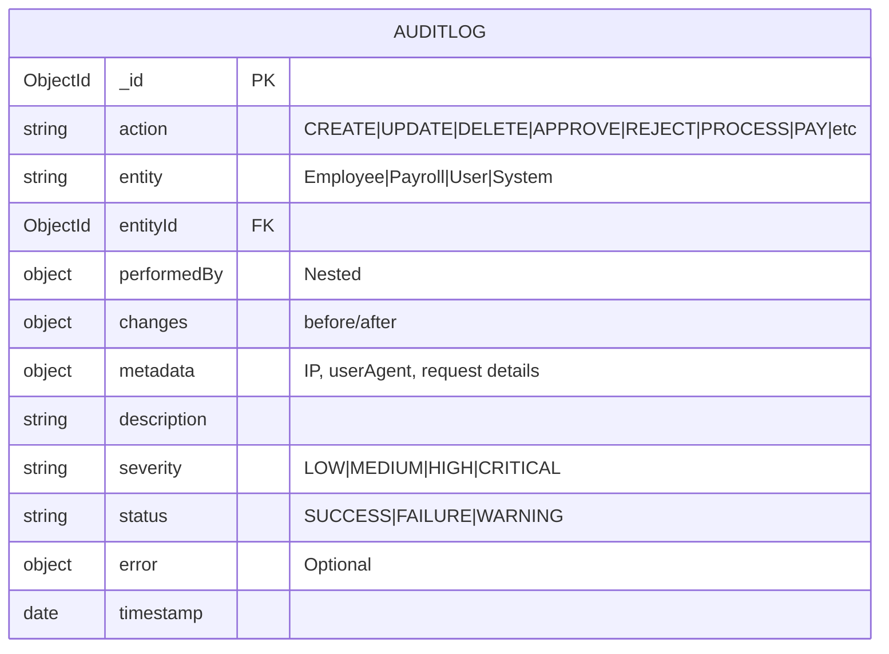

**Key Features**:
- **Comprehensive Logging**: All CRUD operations tracked
- **Change Tracking**: Before/after snapshots
- **Automatic Severity**: Based on action type (DELETE=CRITICAL, UPDATE=HIGH)
- **Metadata Capture**: IP address, user agent, request method/URL
- **Performance**: Multiple compound indexes for fast queries

**Virtual Properties**:
- `formattedTimestamp` - IST formatted timestamp
- `changeSummary` - Human-readable change description

**Static Methods**:
- `getEntityHistory()` - Get history for specific entity
- `getUserActivity()` - Get user's activity log
- `getRecentCritical()` - Get recent critical logs
- `getActivitySummary()` - Aggregated activity statistics
- `searchLogs()` - Advanced log filtering

### 3.5 Notification Model

**File**: [Notification.js](file:///c:/Projects/payroll/backend/src/models/Notification.js) (69 lines, 1356 bytes)

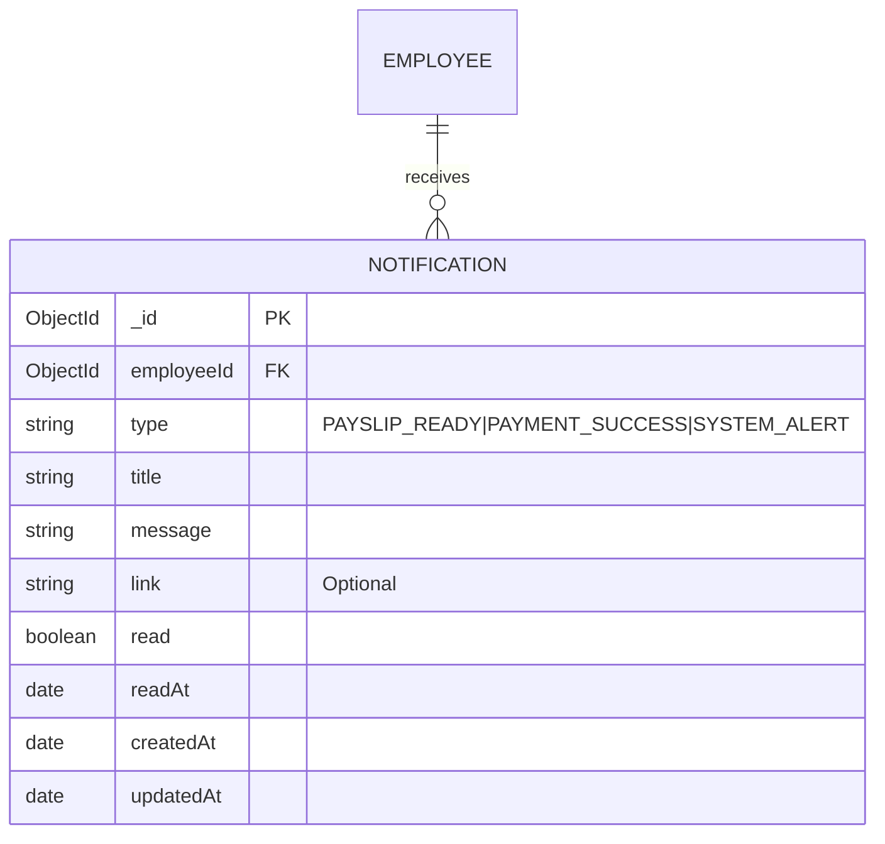

**Key Features**:
- **Type-based Categorization**: Payslip, payment, and system alerts
- **Read Tracking**: Boolean flag with timestamp
- **Index Optimization**: Compound indexes on employee and read status

**Instance Methods**:
- `markAsRead()` - Mark notification as read

**Static Methods**:
- `getUnreadCount()` - Get unread count for employee
- `getEmployeeNotifications()` - Get employee notifications with pagination

### 3.6 Database Relationships

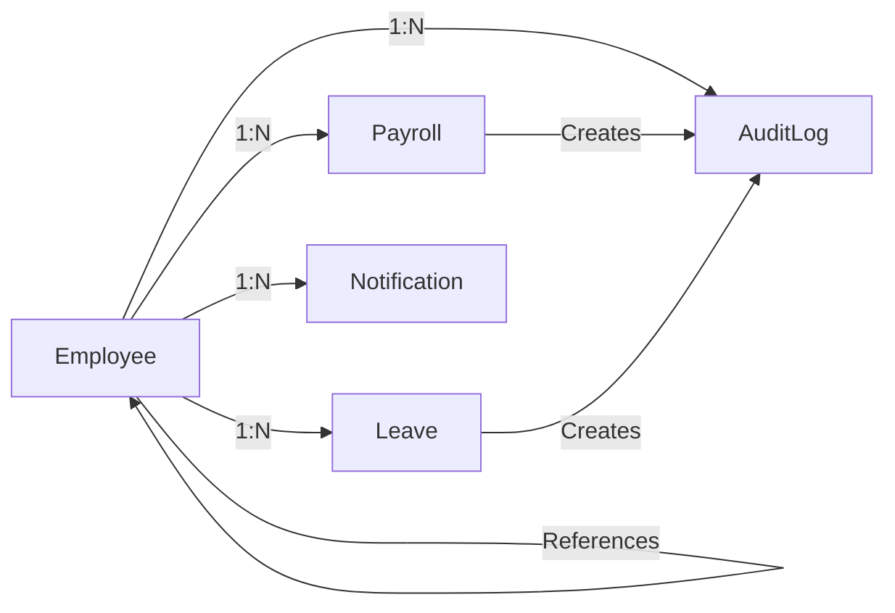

**Relationship Summary**:
- Employee ↔ Payroll: One-to-Many
- Employee ↔ Leave: One-to-Many
- Employee ↔ Notification: One-to-Many
- All Models → AuditLog: Many-to-Many (tracking)

---

## 4. Frontend Architecture

### 4.1 Technology Stack

**Core**: React 19 with Vite build tool  
**UI Framework**: Ant Design 6.1.1 + TailwindCSS 3.4.13  
**Routing**: React Router DOM 7.10.1  
**State Management**: React Context API + Custom Hooks  
**Forms**: React Hook Form + Zod validation  
**Real-time**: Socket.io Client 4.8.1  
**Charts**: Recharts 3.6.0 + Ant Design Charts  
**HTTP Client**: Axios 1.13.2  
**Animations**: Framer Motion 12.23.26

### 4.2 Application Structure

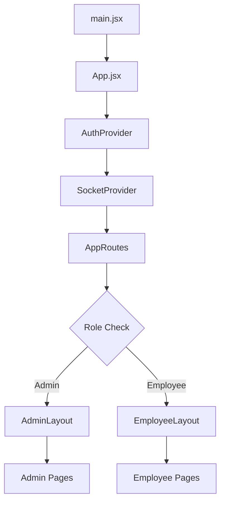

### 4.3 Routing Architecture

**File**: [AppRoutes.jsx](file:///c:/Projects/payroll/frontend/src/routes/AppRoutes.jsx)

#### Public Routes
- `/login` - Login page with role-based redirection
- `/forgot-password` - Password reset request
- `/reset-password/:token` - Token-based password reset

#### Admin Portal (`/admin/*`)
| Route | Component | Purpose |
|-------|-----------|---------|
|`/admin/dashboard`|[Dashboard.jsx](file:///c:/Projects/payroll/frontend/src/pages/admin/Dashboard.jsx)|Admin analytics & statistics|
|`/admin/employees`|[EmployeeList.jsx](file:///c:/Projects/payroll/frontend/src/pages/admin/EmployeeList.jsx)|Employee directory with filters|
|`/admin/employees/new`|[EmployeeForm.jsx](file:///c:/Projects/payroll/frontend/src/pages/admin/EmployeeForm.jsx)|Add new employee|
|`/admin/employees/:id/view`|[EmployeeDetail.jsx](file:///c:/Projects/payroll/frontend/src/pages/admin/EmployeeDetail.jsx)|View employee details|
|`/admin/employees/:id/edit`|[EmployeeForm.jsx](file:///c:/Projects/payroll/frontend/src/pages/admin/EmployeeForm.jsx)|Edit employee|
|`/admin/payroll`|[PayrollList.jsx](file:///c:/Projects/payroll/frontend/src/pages/admin/PayrollList.jsx)|Payroll management|
|`/admin/payroll/:month`|[PayrollDetail.jsx](file:///c:/Projects/payroll/frontend/src/pages/admin/PayrollDetail.jsx)|Month-specific payroll|
|`/admin/reports`|[Reports.jsx](file:///c:/Projects/payroll/frontend/src/pages/admin/Reports.jsx)|Analytics & reports|
|`/admin/leaves`|[LeaveApprovals.jsx](file:///c:/Projects/payroll/frontend/src/pages/admin/LeaveApprovals.jsx)|Leave approval system|
|`/admin/settings`|[Settings.jsx](file:///c:/Projects/payroll/frontend/src/pages/admin/Settings.jsx)|Admin settings|

#### Employee Portal (`/employee/*`)
| Route | Component | Purpose |
|-------|-----------|---------|
|`/employee/dashboard`|[Dashboard.jsx](file:///c:/Projects/payroll/frontend/src/pages/employee/Dashboard.jsx)|Employee dashboard|
|`/employee/payslips`|[Payslips.jsx](file:///c:/Projects/payroll/frontend/src/pages/employee/Payslips.jsx)|Payslip viewing & download|
|`/employee/leaves`|[MyLeaves.jsx](file:///c:/Projects/payroll/frontend/src/pages/employee/MyLeaves.jsx)|Leave management|
|`/employee/notifications`|[Notifications.jsx](file:///c:/Projects/payroll/frontend/src/pages/employee/Notifications.jsx)|Notification center|
|`/employee/profile`|[Profile.jsx](file:///c:/Projects/payroll/frontend/src/pages/employee/Profile.jsx)|Profile management|

### 4.4 State Management

#### Context Providers

**AuthContext** ([AuthContext.jsx](file:///c:/Projects/payroll/frontend/src/contexts/AuthContext.jsx)):
- `user` - Current user object
- `loading` - Authentication loading state
- `login(credentials)` - Login function
- `logout()` - Logout function
- `isAuthenticated` - Boolean authentication status
- `isAdmin` - Admin role check
- `isEmployee` - Employee role check

**SocketContext** ([SocketContext.jsx](file:///c:/Projects/payroll/frontend/src/contexts/SocketContext.jsx)):
- Socket.io connection management
- Real-time event listeners
- Automatic reconnection logic

#### Custom Hooks (8 hooks)

| Hook | Purpose | File |
|------|---------|------|
|`useEmployees`|Employee CRUD operations|[useEmployees.js](file:///c:/Projects/payroll/frontend/src/hooks/useEmployees.js)|
|`useCreateEmployee`|Employee creation|[useCreateEmployee.js](file:///c:/Projects/payroll/frontend/src/hooks/useCreateEmployee.js)|
|`useUpdateEmployee`|Employee updates|[useUpdateEmployee.js](file:///c:/Projects/payroll/frontend/src/hooks/useUpdateEmployee.js)|
|`usePayroll`|Payroll operations|[usePayroll.js](file:///c:/Projects/payroll/frontend/src/hooks/usePayroll.js)|
|`useProcessPayroll`|Payroll processing|[useProcessPayroll.js](file:///c:/Projects/payroll/frontend/src/hooks/useProcessPayroll.js)|
|`usePayslips`|Payslip retrieval|[usePayslips.js](file:///c:/Projects/payroll/frontend/src/hooks/usePayslips.js)|
|`useNotifications`|Notification management|[useNotifications.js](file:///c:/Projects/payroll/frontend/src/hooks/useNotifications.js)|
|`useEmployeeDashboard`|Dashboard data|[useEmployeeDashboard.js](file:///c:/Projects/payroll/frontend/src/hooks/useEmployeeDashboard.js)|

### 4.5 API Integration Layer

**Axios Configuration**: [axios.js](file:///c:/Projects/payroll/frontend/src/api/axios.js)
- Automatic token injection
- Centralized error handling
- Request/response interceptors

**API Modules** (7 modules):
- [authApi.js](file:///c:/Projects/payroll/frontend/src/api/authApi.js) - Authentication APIs
- [employeeApi.js](file:///c:/Projects/payroll/frontend/src/api/employeeApi.js) - Employee APIs
- [payrollApi.js](file:///c:/Projects/payroll/frontend/src/api/payrollApi.js) - Payroll APIs
- [payslipApi.js](file:///c:/Projects/payroll/frontend/src/api/payslipApi.js) - Payslip APIs
- [leaveApi.js](file:///c:/Projects/payroll/frontend/src/api/leaveApi.js) - Leave APIs
- [notificationApi.js](file:///c:/Projects/payroll/frontend/src/api/notificationApi.js) - Notification APIs

### 4.6 Component Architecture

#### Layout Components (6 files)
- `AdminLayout` - Admin portal wrapper with sidebar
- `EmployeeLayout` - Employee portal wrapper
- `Sidebar` - Navigation sidebar
- `Header` - Top navigation bar
- `Navbar` - Main navigation
- `Breadcrumb` - Navigation breadcrumbs

#### Domain Components (6 files)
- `EmployeeCard` - Employee card display
- [EmployeeForm.jsx](file:///c:/Projects/payroll/frontend/src/components/domain/EmployeeForm.jsx) - Comprehensive employee form (42756 bytes)
- `NotificationItem` - Notification display
- `PayrollRow` - Payroll table row
- `PayslipPreview` - Payslip preview modal
- `SalaryBreakdown` - Salary component breakdown

#### Common Components (4 files)
- `SkeletonTable` - Loading skeleton for tables
- `ConfirmDialog` - Confirmation modals
- `ErrorBoundary` - Error handling
- `LoadingSpinner` - Loading indicators

#### UI Primitives (2 files)
- Shadcn/ui components (Button, Input, etc.)

### 4.7 UI/UX Features

**Design System**:
- Ant Design component library
- TailwindCSS utility classes
- Custom theme configuration
- Responsive design (mobile-first)

**Animations**:
- Framer Motion for page transitions
- Lottie animations for illustrations
- Skeleton loaders for better UX

**Interactive Elements**:
- SweetAlert2 for confirmations
- Toast notifications
- Real-time updates via Socket.io
- CountUp animations for statistics

**Charts & Visualizations**:
- Recharts for payroll trends
- Ant Design Charts for analytics
- Department-wise employee distribution
- Monthly payroll summaries

---

## 5. Implemented Features

### 5.1 Authentication & Authorization

**Module 1: Authentication System**

✅ **Implemented Features**:
- JWT-based authentication with 7-day token expiry
- Role-based routing (Admin vs Employee portals)
- Password hashing using bcrypt
- Forgot password functionality with email link
- Reset password with cryptographic token (1-hour expiry)
- Change password for authenticated users
- Profile updates (phone, address)
- Last login tracking
- Protected routes with middleware
- Automatic token injection in API calls
- Token refresh on authentication

**Security Measures**:
- Passwords stored as bcrypt hashes (10 salt rounds)
- JWT tokens stored in localStorage
- Automatic logout on token expiry
- Role-based access control (RBAC)
- Input validation on all endpoints
- CORS protection
- XSS prevention

### 5.2 Employee Management

**Module 2: Employee CRUD Operations**

✅ **Implemented Features**:
- Create employee with auto-generated ID
- Update employee information
- Soft delete (deactivate) employees
- View employee details
- Paginated employee listing (10 per page)
- Search and filter by:
  - Department
  - Status (Active, Inactive, Terminated, Resigned)
  - Search term (name, email, employee ID)
- Employee statistics dashboard
- Department-wise distribution
- Bulk import from CSV
- Export to Excel
- Audit logging for all operations
- Email notifications on creation

**Employee Data Fields**:
- Personal: Name, email, phone, DOB, address
- Employment: Department, designation, join date, status
- Bank: Account number, holder name, IFSC, bank, branch
- Salary: Basic, HRA, DA, allowances, PF%, PT, ESI%

### 5.3 Payroll Processing

**Module 3: Monthly Payroll System**

✅ **Implemented Features**:
- Batch payroll processing for all active employees
- Individual payroll calculation
- Salary components:
  - **Earnings**: Basic, HRA, DA, Special Allowance, Other Allowances
  - **Deductions**: PF (12%), Professional Tax (₹200), ESI (0.75%)
- LOP (Loss of Pay) integration with leave system
- Adjustments system:
  - Bonus
  - Penalty
  - Allowance
  - Deduction
  - Reimbursement
  - Recovery
- Payroll workflow: Pending → Approved → Paid
- Approval system with admin authorization
- Payment simulation with transaction ID generation
- Monthly payroll summaries and statistics
- Filtered payroll viewing
- Payroll detail view with breakdown

**Calculation Logic**:
```
Gross Salary = Basic + HRA + DA + Special Allowance + Other Allowances
Total Deductions = PF + Professional Tax + ESI
LOP Deduction = (Gross Salary / Working Days) × LOP Days
Net Salary = Gross - Deductions - LOP + Adjustments
```

### 5.4 Payslip Management

**Module 4: Payslip Generation & Distribution**

✅ **Implemented Features**:
- PDF payslip generation using PDFKit
- Cloud storage integration (Cloudinary)
- Batch payslip generation
- Email delivery of payslips
- Download payslip functionality
- Payslip preview in UI
- Payslip history viewing
- Automatic payslip generation on payment
- Real-time notifications on payslip ready

**Payslip Contents**:
- Company header
- Employee details
- Pay period
- Earnings breakdown
- Deductions breakdown
- Adjustments
- Net pay
- Bank details (masked)

### 5.5 Leave Management

**Module 5: Leave Application & Approval**

✅ **Implemented Features**:
- Leave application by employees
- Leave types:
  - Casual (12 days/year)
  - Sick (12 days/year)
  - Earned (18 days/year)
  - LOP (unlimited)
  - Maternity & Paternity
- Leave balance tracking
- Leave approval/rejection by admin
- Rejection reason mandatory
- Leave history viewing
- Pending leave cancellation
- Leave statistics and analytics
- Real-time notifications on approval/rejection
- Filter by type, status, date range
- Leave calendar view

**Leave Workflow**:
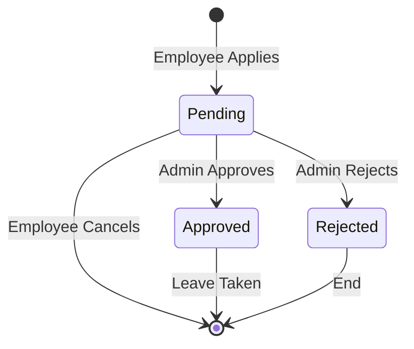

### 5.6 Notification System

**Module 6: Real-time Notifications**

✅ **Implemented Features**:
- In-app notification system
- Real-time updates via Socket.io
- Notification types:
  - Payslip ready
  - Payment success
  - Leave approved/rejected
  - System alerts
- Unread count badge
- Mark as read functionality
- Mark all as read
- Notification history
- Email notifications for:
  - Welcome email on employee creation
  - Password reset link
  - Payslip delivery
- Admin broadcast notifications
- User-specific targeting

### 5.7 Reports & Analytics

**Module 7: Admin Reports**

✅ **Implemented Features**:
- Employee statistics dashboard
- Department-wise distribution charts
- Payroll summary by month
- Monthly trends visualization
- Leave analytics
- Status-based employee counts
- Export functionality (Excel)
- Custom date range filtering
- Real-time data updates

**Charts Implemented**:
- Bar charts for department distribution
- Line charts for payroll trends
- Pie charts for status distribution
- Area charts for cumulative statistics

### 5.8 Bulk Operations

**Module 8: Import/Export**

✅ **Implemented Features**:
- CSV employee import with validation
- Excel employee export
- Excel payroll export
- Bulk error handling
- Transaction rollback on failure
- Progress indicators
- Download templates

### 5.9 Audit Trail

**Module 9: Comprehensive Logging**

✅ **Implemented Features**:
- All CRUD operations logged
- Before/after change tracking
- User identification
- IP address and user agent capture
- Timestamp recording
- Severity classification
- Success/failure status
- Error stack traces
- Searchable audit logs
- Entity history viewing
- User activity tracking

---

## 6. System Workflows

### 6.1 Employee Onboarding Flow

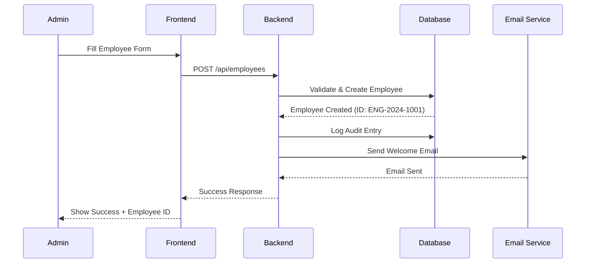

### 6.2 Monthly Payroll Processing Flow

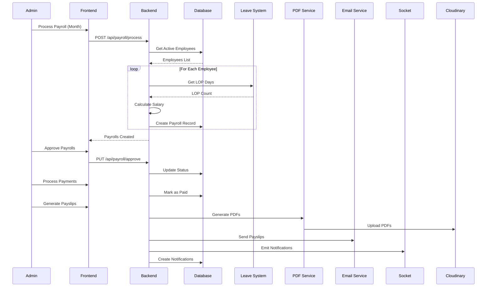

### 6.3 Leave Application Flow

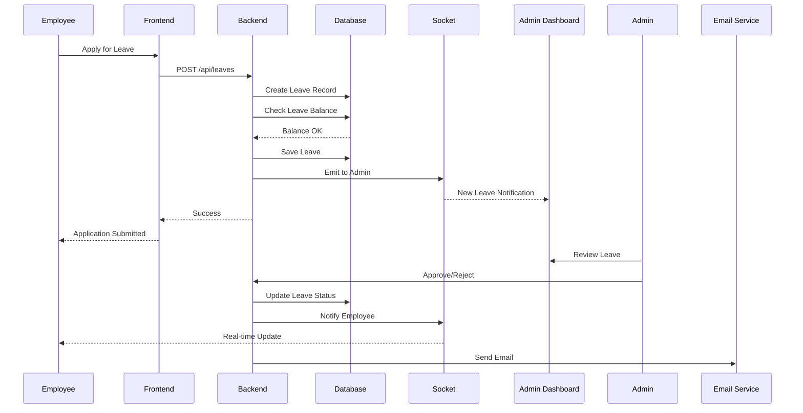

### 6.4 Authentication Flow

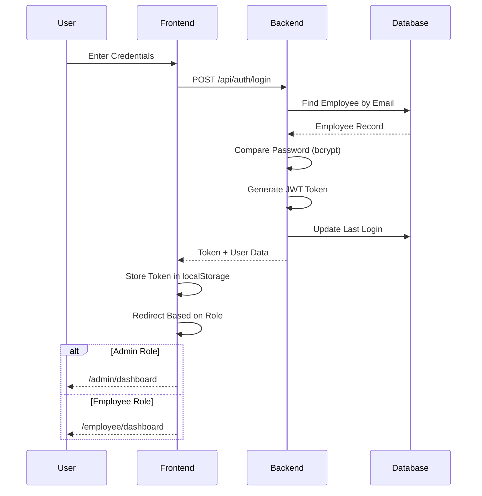

### 6.5 Password Reset Flow

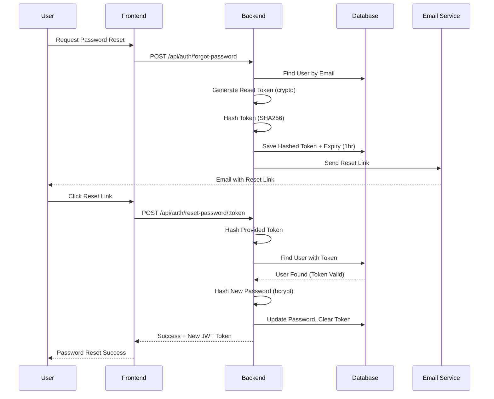

---

## 7. Technology Stack Summary

### 7.1 Backend Dependencies

```json
{
  "bcryptjs": "^2.4.3",          // Password hashing
  "cloudinary": "^2.8.0",         // Cloud file storage
  "cors": "^2.8.5",               // Cross-origin requests
  "csv-parser": "^3.2.0",         // CSV parsing
  "dotenv": "^16.3.1",            // Environment variables
  "express": "^5.2.1",            // Web framework
  "express-validator": "^7.0.1",  // Input validation
  "jsonwebtoken": "^9.0.3",       // JWT authentication
  "mongoose": "^9.0.1",           // MongoDB ODM
  "multer": "^2.0.2",             // File uploads
  "nodemailer": "^7.0.11",        // Email sending
  "pdfkit": "^0.17.2",            // PDF generation
  "socket.io": "^4.8.1",          // Real-time communication
  "xlsx": "^0.18.5"               // Excel operations
}
```

### 7.2 Frontend Dependencies

```json
{
  "@ant-design/charts": "^2.6.6",      // Charts
  "@ant-design/icons": "^6.1.0",       // Icons
  "antd": "^6.1.1",                    // UI framework
  "axios": "^1.13.2",                  // HTTP client
  "dayjs": "^1.11.19",                 // Date manipulation
  "framer-motion": "^12.23.26",        // Animations
  "lottie-react": "^2.4.1",            // Lottie animations
  "react": "^19.2.0",                  // React library
  "react-hook-form": "^7.68.0",        // Form handling
  "react-router-dom": "^7.10.1",       // Routing
  "recharts": "^3.6.0",                // Charts
  "socket.io-client": "^4.8.1",        // WebSocket client
  "sweetalert2": "^11.26.16",          // Alerts
  "tailwindcss": "3.4.13",             // CSS framework
  "zod": "^4.1.13"                     // Validation
}
```

---

## 8. Security Implementation

### 8.1 Authentication Security
- ✅ JWT tokens with 7-day expiry
- ✅ Bcrypt password hashing (10 salt rounds)
- ✅ Token-based password reset with expiry
- ✅ Cryptographic token generation (32 bytes)
- ✅ Automatic logout on token expiry
- ✅ Password strength validation (min 6 characters)

### 8.2 Authorization Security
- ✅ Role-based access control (Admin/Employee)
- ✅ Route protection middleware
- ✅ API endpoint protection
- ✅ User status validation (Active only)
- ✅ Ownership verification for employee data

### 8.3 Data Security
- ✅ Bank account number masking (`****XXXX`)
- ✅ Password field excluded from queries (`select: false`)
- ✅ Input validation on all endpoints
- ✅ XSS prevention via input sanitization
- ✅ MongoDB injection prevention (Mongoose)
- ✅ CORS configuration

### 8.4 Audit & Compliance
- ✅ Comprehensive audit logging
- ✅ Change tracking (before/after)
- ✅ IP address and user agent logging
- ✅ Timestamp recording
- ✅ User identification in all operations

---

## Conclusion

PayrollPro is a **production-ready, full-featured payroll management system** implementing industry best practices. The system successfully demonstrates:

**✅ Complete Feature Implementation**:
- 9 major modules fully implemented
- 40+ API endpoints operational
- 14 responsive UI pages
- Real-time communication via Socket.io

**✅ Robust Architecture**:
- Scalable dual-portal design
- Clean code separation (MVC pattern)
- Comprehensive error handling
- Extensive validation at all layers

**✅ Security & Compliance**:
- JWT authentication
- Role-based access control
- Audit trail for all operations
- Data masking and encryption

**✅ Professional UX**:
- Modern, responsive design
- Real-time updates
- Loading states and animations
- Interactive charts and visualizations

**Project Status**: All core features implemented and functional. System is ready for academic demonstration and potential deployment with environment-specific configurations.

---

**End of Analysis Report**
